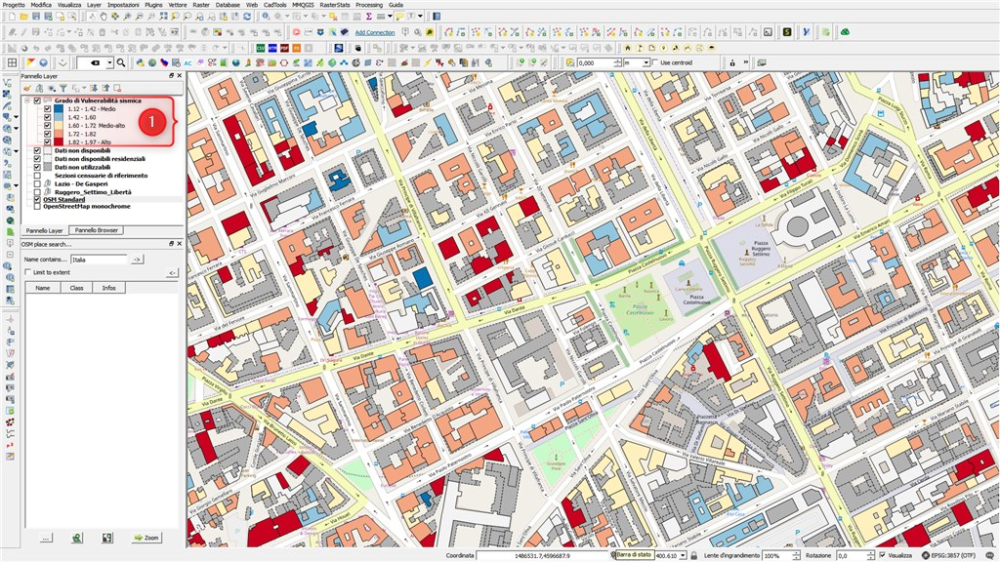
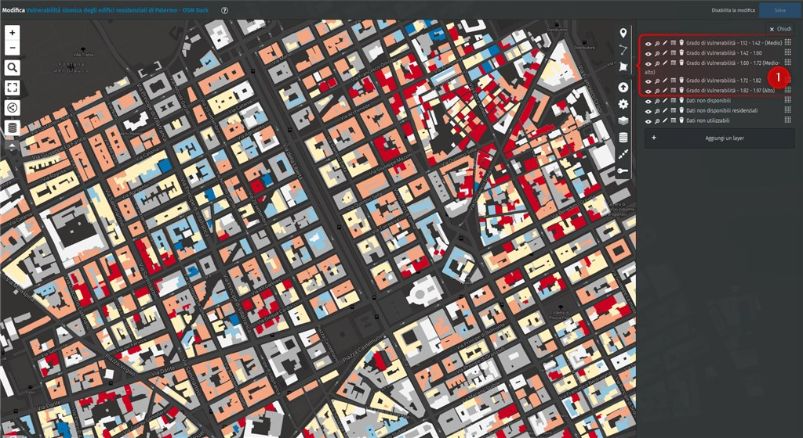
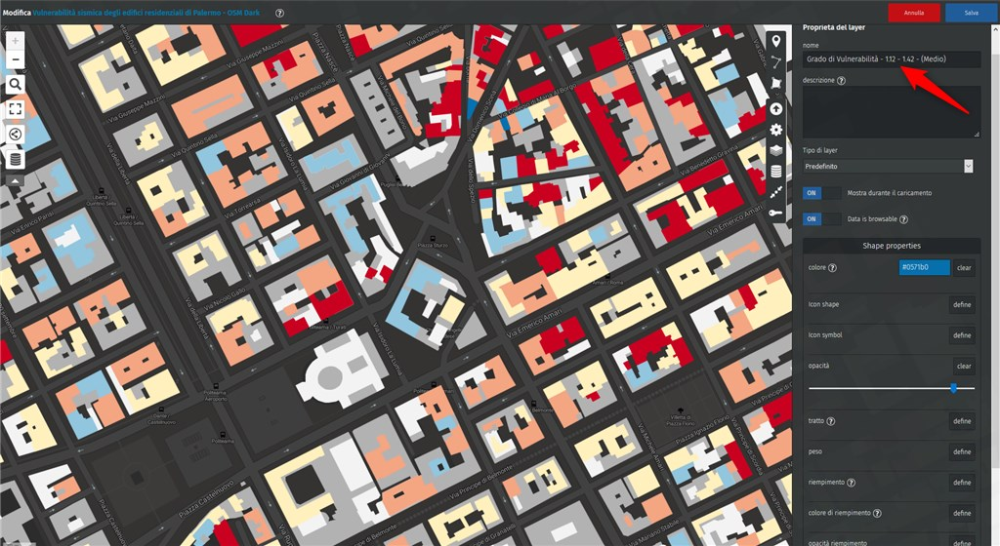
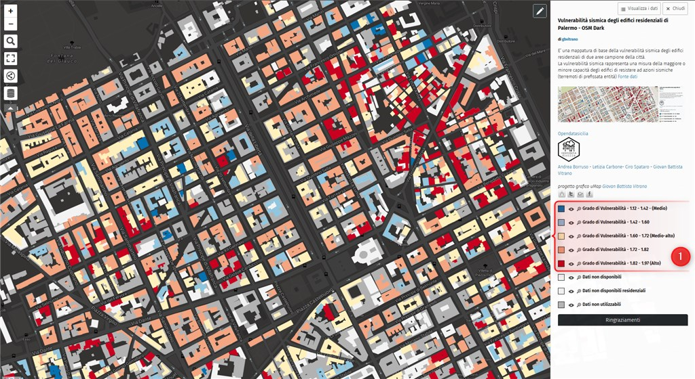
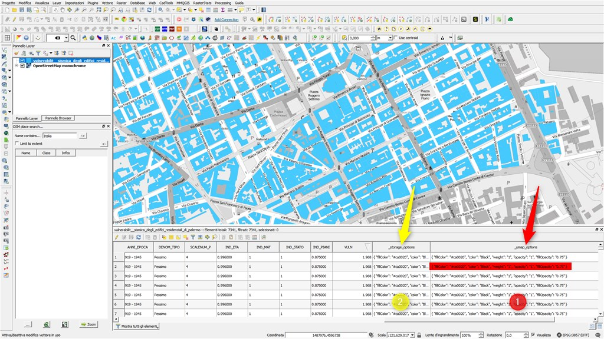
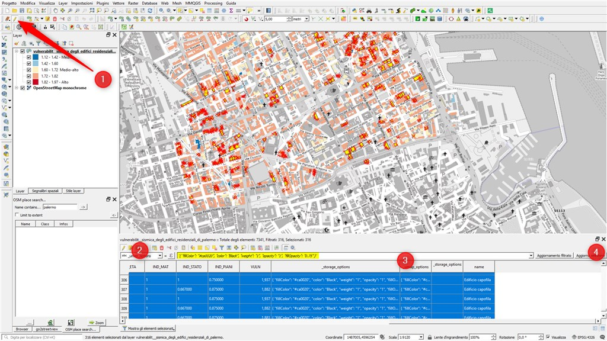
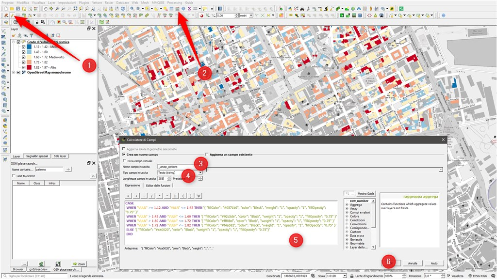
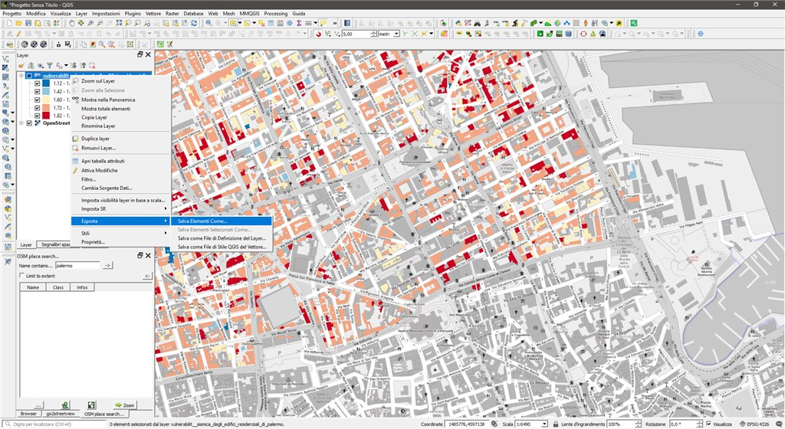
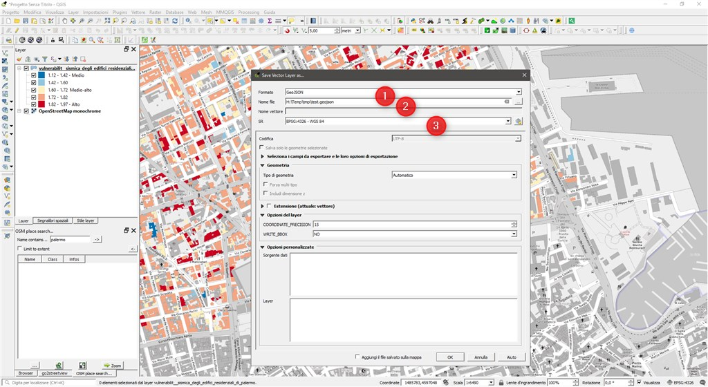
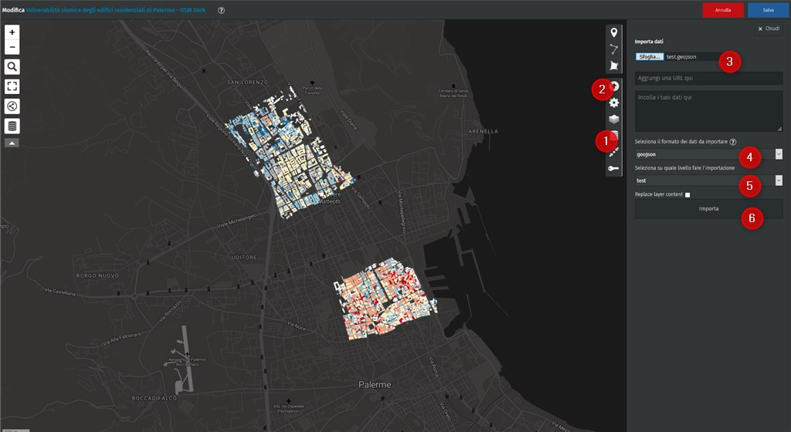

---

* autore: [gbvitrano](https://twitter.com/gbvitrano)
* issue:

[uMap](http://umap.openstreetmap.fr/it/) è un software potentissimo per la creazione di mappe online, da inserire nel proprio sito, che fanno uso di [OpenStreetMap](http://osm.org/) come sfondo.
Il software è creato dall’italo-francese [Yohan Boniface](http://yohanboniface.me/), rilasciato in open source con la licenza “[do what the fuck you want to public license](https://github.com/yohanboniface/uMap)“, scritto in [django](https://www.djangoproject.com/) e [leaflet](http://leafletjs.com/), e reso disponibile sugli spazi di [OpenStreetMap France](http://www.openstreetmap.fr/) – http://umap.openstreetmap.fr. (cit. [da de.straba.us](http://de.straba.us/2015/05/22/tutorial-creare-una-mappa-online-con-fotografie-in-umap-aggiornabile-con-ethercalc/))

In questo breve tutorial non voglio spiegare cosa è uMap e come funziona, questo è stato fatto benissimo da [@napo](https://twitter.com/napo) nel suo [blog de.straba.us](http://de.straba.us/2015/05/22/tutorial-creare-una-mappa-online-con-fotografie-in-umap-aggiornabile-con-ethercalc/), da [@piersoft](https://twitter.com/Piersoft) nel suo [blog](http://www.piersoft.it/da-un-csv-o-geojson-ad-una-mappa/) [(tutti gli articoli su uMap)](http://www.piersoft.it/?s=umap) e da [@cirospat](https://twitter.com/cirospat) nel suo [Tutorial per creare mappe online su UMAP aggiornabili con file CSV da GOOGLEDRIVE](https://cirospat.readthedocs.io/it/latest/tutorial-googledrive-to-umap.html?highlight=umap), proverò a spiegare come tematizzare velocemente i poligoni che vengono importati in uMap da altri software GIS.

La cosa più semplice da fare è quella di esportare i poligoni tematizzati del nostro file in oggetto in  più file, ovvero, suddividiamo i poligoni del file originale in **n** file, tanti quanto sono i temi.



Il file/layer Grado di Vulnerabilità sismica è tematizzato secondo una scala di vulnerabilità in 5 categorie (1) per riproporre velocemente la stessa tematizzazione in [uMap](http://umap.openstreetmap.fr/it/) basta salvare/esportare i poligoni di ogni categoria in un nuovo file.



I file ottenuti dall’esportazione dei poligoni di ogni singola categoria, importati in [uMap](http://umap.openstreetmap.fr/it/)  (1)



Dal pannello Shape propertis configuriamo le proprietà dei poligoni di tutto il layer, colore del riempimento, trasparenza, linea di contorno, etc



Risultato finale, il file/layer originale, è stato suddivido in 5 nuovi file, ognuno dei quali può essere attivato o disattivato al bisogno.

**Ma se non voglio o non posso suddividere il file di base in tanti file…?**
**o se non voglio avere una colonna infinita di layer nel pannello delle informazioni di uMap…?**
*devo tematizzare singolarmente ogni poligono...?*

## Come tematizzare velocemente i poligoni
Studiando la struttura del file **geojson** di [uMap](http://umap.openstreetmap.fr/it/) mi sono reso conto che [uMap](http://umap.openstreetmap.fr/it/) aggiunge una o più colonne al file viene importato, nello specifico per tematizzare i poligoni viene aggiunta la colonna _umap_options, (nella vecchia versione la colonna si chiamava _storage_options).

In questa colonna vengono scritte tutte le info che riguardano le proprietà del poligono, colore, trasparenza, spessore delle linee, ect… che tradotto in codice json si scrive così:

```
{ "fillColor": "#b2b2b2", "color": "Black", "weight": "1", "opacity": "1", "fillOpacity": "0.75", "dashArray": "4" }
```

I **valori** sono a titolo di esempio e vanno adattati alle proprie esigenze.

- **fillColor** = colore di riempimento
- **color** = colore bordo
- **weight** = spessore bordo
- **opacity** = opacità bordo
- **fillOpacity** = opacità riempimento
- **dashArray** = tratteggio linea bordo, per ottenere la linea continua, basta omettere il comando



Per aggiungere la nuova colonna ho utilizzato [QGIS](https://www.qgis.org/it/site/) , colonna _umap_options (1) per la nuova versione sel server uMap o la colonna _storage_options  (2) per la vecchia versione di uMap. Dopo aver aggiunto la nuova colonna non ci resta che importare il file su uMap ed i poligoni verranno tematizzati automaticamente secondo le nostre istruzioni.

## Come popolare la nuova colonna _umap_options



In file txt preparatevi i codici json da inserire, per ogni tematismo, nel mio sono 5, ma l'unica cosa che cambia è fillColor ovvero il  colore di riempimento, ma siete liberi di modificare tutti i parametri. (Non è un metodo elegante, ma funziona, a breve [@totofiandata](https://twitter.com/totofiandaca) ci suggerirà un metodo più professionale)

Le azioni da fare sono semplicissime:
1. Attivare le modifiche al file e selezionare i poligoni ai quali vogliamo aggiungere il codice json per uMap;
3. Spostarsi nel campo delle espressioni e incollare i codice preparato in predenza **'{ "fillColor": "#ca0020", "color": "Black", "weight": "1", "opacity": "1", "fillOpacity": "0.75" }'** *virgolette incluse*;
4. In ultimo cliccare su aggiorna selezione;
5. Ripetere la procedura, per ogni tematismo.

Come suggerito da [@totofiandaca](https://twitter.com/totofiandaca) il campo si può popolare con un metodo più elegante e veloce, usando il **Calcolatore di Campi**



Come per il precedente metodo dobbiamo rendere il file editabile, aprire il Calcolatore di Campi ed inserire un’espressione, come da immagine.
1. Attivare le modifiche al file;
2. Aprire il Calcolatore di Campi;
3. Scrivere il nome del nuovo campo (**_umap_options**), spuntare l’opzione **Crea un nuovo campo**;
4. Selezionare il tipo e la lunghezza del campo in uscita, in questo caso è **Testo**, **255** caratteri;
5. Scrivere l’espressione per un tema graduato con 5 classi;
6. Cliccare ok per avviare l’operazione.

Visto che la tematizzazione del layer è stata fatta utilizzando il campo **VULN** con il metodo **[Graduato](https://docs.qgis.org/2.18/it/docs/user_manual/working_with_vector/vector_properties.html#graduated-renderer)**, che permette di suddividere i dati di una data colonna in un certo numero di classi e quindi scegliere uno stile differente per ciascuna classe, [@totofiandaca](https://twitter.com/totofiandaca) ha scritto l'espressione, in basso a seguire, da usare nel Calcolatore di Campi, per popolare velocemente il campo _umap_options, secondo le nostre classi. (grazie Totò)

```
CASE
 WHEN "VULN" >= 1.12 AND "VULN" <= 1.42 THEN '{ "fillColor": "#0571b0", "color": "Black", "weight": "1", "opacity": "1", "fillOpacity": "0.75" }'
 WHEN "VULN" > 1.42 AND "VULN" <= 1.60 THEN '{ "fillColor": "#92c5de", "color": "Black", "weight": "1", "opacity": "1", "fillOpacity": "0.75" }'
 WHEN "VULN" > 1.60 AND "VULN" <= 1.72 THEN '{ "fillColor": "#fff0bd", "color": "Black", "weight": "1", "opacity": "1", "fillOpacity": "0.75" }'
 WHEN "VULN" > 1.72 AND "VULN" <= 1.82 THEN '{ "fillColor": "#f4a582", "color": "Black", "weight": "1", "opacity": "1", "fillOpacity": "0.75" }'
 ELSE '{ "fillColor": "#ca0020", "color": "Black", "weight": "1", "opacity": "1", "fillOpacity": "0.75"}'
 END
```



Dopo aver popolato il nuovo campo, non ci resta che esportare il file in formato geojson, facendo attenzione al Sistema di Riferimento SR, che deve essere EPSG: 4326-WGS 84 perché è il sistema di riferimento usato da uMap.



Esportare il nuovo file in geojson:
1. Selezionare il formato dal menù a tendina, **Geojson**;
2. Indicare il nome e la cartella dove salvare il file;
3. Selezionare SR corretto per uMap **EPSG: 4326 - WGS 84**.



1. Aggiungere un nuovo layer;
2. Cliccare sull'icona Importa dati;
3. Caricare il nuovo file;
4. Selezionare il formato dei dati;
5. Selezionare il layer dove andranno caricati i dati; 
6. Infine cliccare sul pulsante Importa.

Grazie a [@aborruso](https://twitter.com/aborruso) e [@totofiandaca](https://twitter.com/totofiandaca) per i preziosi suggerimenti

Qui un esempio, la mappa delle [Vulnerabilità sismica degli edifici residenziali di Palermo](http://u.osmfr.org/m/129487/)

<a href="http://u.osmfr.org/m/129487/"></a>


