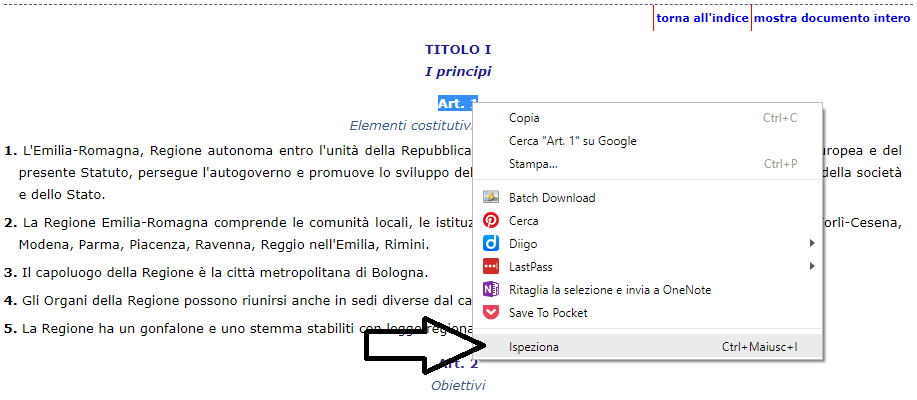

- issue correlata: [#29](https://github.com/opendatasicilia/tansignari/issues/29)
- autore: [Lorenzo Perone](https://github.com/lorenzoperone); fornitore della ricetta: [Andrea Borruso](https://github.com/aborruso);
---


Per estrarre un elenco di elementi utili da una lunga pagina web come quella di una legge, è possibile utilizzare una tecnica replicabile modificando solo il riferimeno all'elemento **css** da scaricare.

Utilizziamo [questa pagina](https://demetra.regione.emilia-romagna.it/al/articolo?urn=er%3Aassemblealegislativa%3Alegge%3A2005%3B13&dl_t=text%2Fxml&dl_a=y&dl_id=10&pr=idx%2C0%3Bartic%2C0%3Barticparziale%2C1&anc=tit1&fbclid=IwAR0Lcn8E89VosOWln-amBDx5N8rW1WiOsKjcBFv_7TjD7YsbJhWz0UtqUHk) come esempio per estrarre, in un elenco, gli articoli e la loro definizione. Se guardiamo l'immagine della pagina sopra l'idea è quella di avere come risultato un'elenco di questo tipo:

| Articolo | Definizione |
| --- | --- |
|Art. 1|Elementi costitutivi della Regione|
|Art. 2|Obiettivi|
|...|...|

Per fare questo è utile una **shell** unix, disponibile in linux e Mac, ma che è possibile installare anche in ambiente Windows, uno dei modi più semplici è descritto in questa ricetta **(INSERIRE LINK)**.

Una volta disponibile la shell è necessario installare l'eseguibile **scrape** dispobibile a questo [indirizzo](https://github.com/aborruso/scrape-cli/releases), una volta scaricato l'eseguibile, ad esempio **scrape.exe** lo salviamo in una cartella del computer ed aggiungiamo il percorso di questa cartella alla variabile **PATH utente** in modo da poterlo lanciare senza dover specificare ogni volta il percorso. Per fare questo apriamo un promt dei comandi windows e digitiamo

```
setx path "%path%;C:\PERCORSO_DELLA_CARTELLA_CHE_SCONTIENE_SCRAPE\"
```
e chiudiamo il prompt.

Ora analizziamo la pagina web con Google Chrome ed utilizziamo il tasto destro del mouse sull'elemento **articolo**



selezionando **Ispeziona** si aprirà l'interfaccia sviluppatore di Chrome


ci posizioniamo sopra l'elemento selezionato e con il tasto destro del mouse e scegliamo **Copy** => **Copy element**, l'elemento copiato è il seguente

```html
<div class="articolo">Art. 1</div>
```

facciamo la stessa cosa per la descrizione dell'articolo ed otteniamo

```html
<div class="articolo_rubrica">Elementi costitutivi della Regione</div>
```

Per estrarre gli elementi individuati sopra si possono scrivere due **query xpath** che utilizzaremo per estrarre gli elementi

```
//div[@class="articolo_rubrica"]/text():
//div[@class="articolo_rubrica"]/text():
```

Con gli elementi che abbiamo individuato siamo pronti per poter estrarre i dati, iniziamo con lo scaricare la pagina web che ci interessa, nel nostro esempio l'url è il seguente

```
https://demetra.regione.emilia-romagna.it/al/articolo?urn=er%3Aassemblealegislativa%3Alegge%3A2005%3B13&dl_t=text%2Fxml&dl_a=y&dl_id=10&pr=idx%2C0%3Bartic%2C0%3Barticparziale%2C1&anc=tit1&fbclid=IwAR0Lcn8E89VosOWln-amBDx5N8rW1WiOsKjcBFv_7TjD7YsbJhWz0UtqUHk
```

utilizzando l'utility **curl** disponibile nelle shell linux scriviamo, nella **shell**, questo comando

```
curl "https://demetra.regione.emilia-romagna.it/al/articolo?urn=er%3Aassemblealegislativa%3Alegge%3A2005%3B13&dl_t=text%2Fxml&dl_a=y&dl_id=10&pr=idx%2C0%3Bartic%2C0%3Barticparziale%2C1&anc=tit1&fbclid=IwAR0Lcn8E89VosOWln-amBDx5N8rW1WiOsKjcBFv_7TjD7YsbJhWz0UtqUHk" >./pagina.html
```

verrà creato un file locale chiamato **pagina.html** che contiene il codice **html** della pagina web, partendo da questo file locale inziamo ad estrarre gli elementi utilizzando il programma **scrape** digitando nella **shell**

```
<./pagina.html scrape -e '//div[@class="articolo_rubrica"]/text()' | tr "\t" "\n" >./
```
questo comando estre i **titoli** e sostituisce il **tab** di output con "**a capo**", ora digitiamo

```
<./pagina scrape -e '//div[@class="articolo"]/text()' | tr "\t" "\n" >./articoli
```
questo comando estre le **descrizione dei titoli** e sostituisce il **tab** di output con "**a capo**", a questo punto siamo pronti per unire i due file **articoli** e **titoli** ottenuti dai comandi sopra digitando nella **shell**

```
paste articoli titoli >./lista.txt
```

abbiamo così ottenuto un file con questo contenuto

```
Art. 1  Elementi costitutivi della Regione
Art. 2  Obiettivi
Art. 3  Politiche ambientali
Art. 4  Politiche del lavoro
Art. 5  Politiche economiche
Art. 6  Politiche sociali
Art. 7  Promozione dell'associazionismo
Art. 8  Le Autonomie locali
Art. 9  Le formazioni sociali
Art. 10 Sviluppo dei territori
Art. 11 Ordinamento europeo e internazionale
Art. 12 Partecipazione della Regione alla formazione e all'attuazione  del diritto comunitario
Art. 13 Attività di rilievo internazionale della Regione
come installare scrape
```
