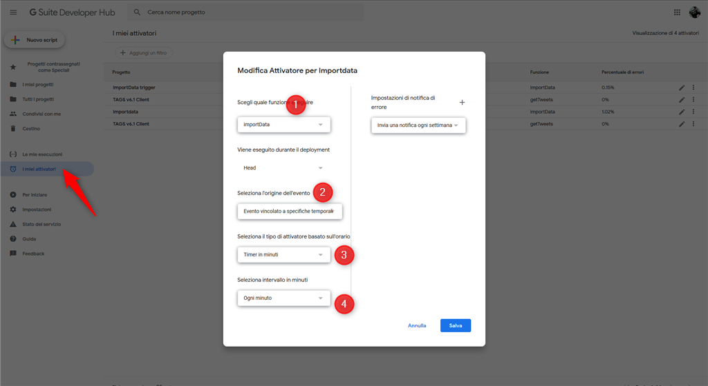
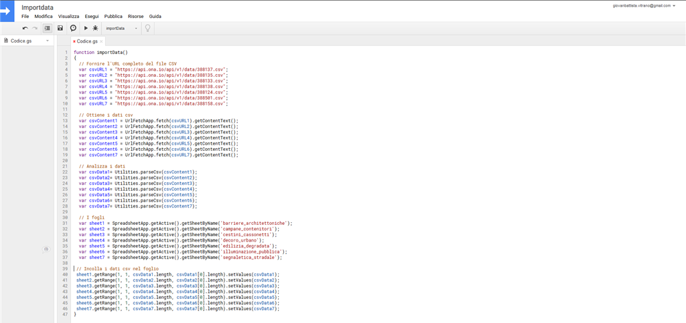

---


La funzione [IMPORTDATA()](https://support.google.com/docs/answer/3093335?hl=en) di Google sheet by default aggiorna i dati ogni ora, ma se avete l’esigenza di avere i dati in tempo reale o quasi, per qualsiasi motivo, esiste una opzione per forzare l’aggiornamento della funzione anche ad ogni minuto.

Supponiamo di voler importare i dati di un file .csv da remoto, https://api.ona.io/api/v1/data/388501.csv, ci posizioniamo nella  cella **A1** del nostro foglio di lavoro scriviamo la seguente funzione:<br><br>
```=IMPORTDATA("https://api.ona.io/api/v1/data/388501.csv")``` <br><br>
in un attimo i dati saranno caricati.


Per forzare l'aggiornamento della funzione basta usare un semplice script


Dal menù **strumenti** (1) cliccare su **Editor di script** (2)


## Script tipo da copiare ed incollare nell'editor di script <br>
**Attenzione** modificate il nome del foglio di lavoro inserito nello script "**NOME FOGLIO DI LAVORO**" con il nome del vostro foglio di lavoro, se il nome del foglio di lavoro inserito nello script non esiste, lo script non si avvia e vi restituisce un errore.

```javascript
function importData()
{
// ATTENZIONE "NOME FOGLIO DI LAVORO" è il nome del foglio di lavoro dove verranno caricati i dati

var csvUrl = "https://api.ona.io/api/v1/data/388501.csv";
var csvContent = UrlFetchApp.fetch(csvUrl).getContentText();
var csvData = Utilities.parseCsv(csvContent);

var sheet = SpreadsheetApp.getActive().getSheetByName('NOME FOGLIO DI LAVORO')
sheet.getRange(1, 1, csvData.length, csvData[0].length).setValues(csvData);
}
```
## Come attivare lo script…?
Si attiva semplicemente cliccando su **esegui** (icona play), la prima volta che lo eseguite vi chiederà l’autorizzazione, verrà visualizzato il messaggio che l’applicazione non è autenticata, non è sicura etc etc… per bypassare tutto questo, cliccare su applicazione avanzate e confermare i permessi per poter lavorare…


Come si può notare nelle script non c’è nessun riferimento al tempo. L’intervallo di tempo di lancio dello script si imposta da **Trigger**


Per personalizzare i valori del **Trigger**, bisogna cliccare su **I miei attivatori** e selezionare quello dedicato allo script appena creato importData() e modificarne i valori. In questa modo lo script attiverà una verifica di nuovi dati (dalla fonte CSV pre impostata nel trigger) con una frequenza temporale del singolo minuto.



Se tutto è andato a buon fine, la funzione ```=IMPORTDATA("https://api.ona.io/api/v1/data/388501.csv")``` che abbiamo scritto precedentemente nella cella **A1** sarà sparita, in quanto adesso è lo script a gestire tutto, e come programmato nel **Trigger** i dati verranno aggiornati ogni minuto.


## Controllare allo stesso tempo più fogli di lavoro



Con qualche piccola modifica alle variabili si possono aggiornare contemporaneamente più fogli di lavoro.

Si potrebbe fare un *array* e fare un *loop*, ma anche cosi funziona e a noi va bene così 🙂

