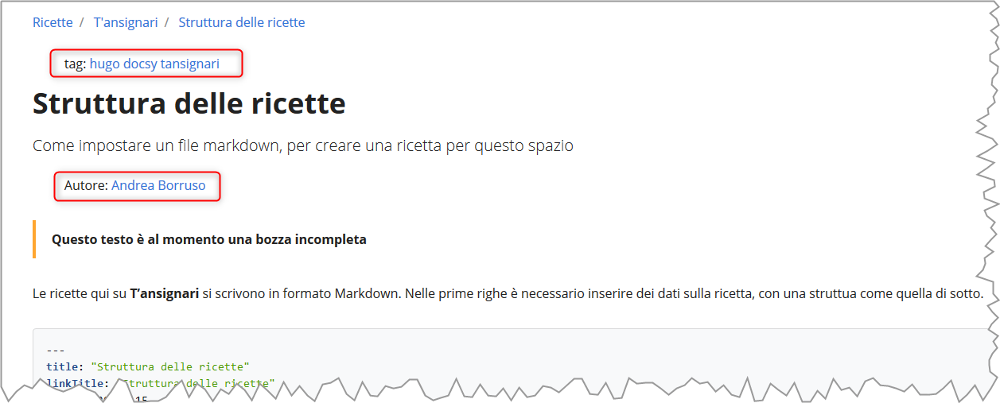

<div class="alert alert-secondary" role="alert">
  <b>Questo testo è al momento una bozza incompleta</b>
</div>

Le ricette qui su **T'ansignari** si scrivono in **formato Markdown**.

## Intestazione "nascosta" di una ricetta

Nelle prime righe di una ricetta è necessario inserire dei dati sulla ricetta, con una struttura come quella di sotto.<br>
È da scrivere in [YAML](https://yaml.org/) ed è il cosiddetto [`Front Matter`](https://gohugo.io/content-management/front-matter/) di Hugo.

```yaml
---
title: "Struttura delle ricette"
linkTitle: "Struttura delle ricette"
date: 2020-02-15
description: >
  Come impostare un file markdown, per creare una ricetta per questo spazio
tags:
  - hugo
  - docsy
  - Bootstap 4
issue: [5]
autori: ["Andrea Borruso"]
chefs: ["Andrea Borruso"]
---
```

Questa parte non verrà visualizzata in modo diretto sul sito. Le informazini contenute verrano però usate per costruire la visualizzazione della pagina (sotto ad esempio i tag e l'autore).



## Testo della ricetta

Il testo vero a proprio va scritto dopo l'intestazione utilizzando il formato Markdown. Quindi ad esempio

```
---
title: "Struttura delle ricette"
linkTitle: "Struttura delle ricette"
date: 2020-02-15
description: >
  Come impostare un file markdown, per creare una ricetta per questo spazio
tags:
  - hugo
  - docsy
  - tansignari
issue:
autori: ["Andrea Borruso"]
chefs: ["Andrea Borruso"]
---

# Titolo 1

Questo è il testo della ricetta che posso scrivere in **Markdown**.

## Titolo 1.1

Approfondiamo

## Titolo 1.2

Altri dettagli

```
